

  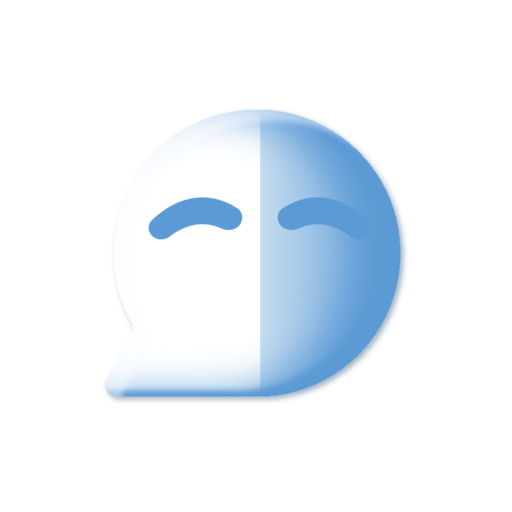

# Common Ground

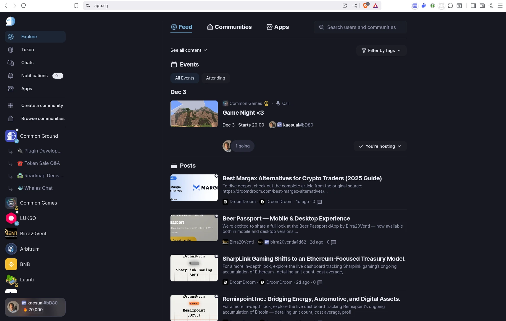

Common Ground is a browser-based, open-source social platform for communities, built as a robust alternative to Discord. 

After years of development, we are proud to release the Common Ground platform under the **AGPLv3 license**. Our goal is to build a fully open social infrastructure that offers the convenience and familiar patterns of modern social platforms while remaining open, accessible, and free from the control of big tech monopolies.

Click to see more screenshots

 

| | | |
|:---:|:---:|:---:|
| 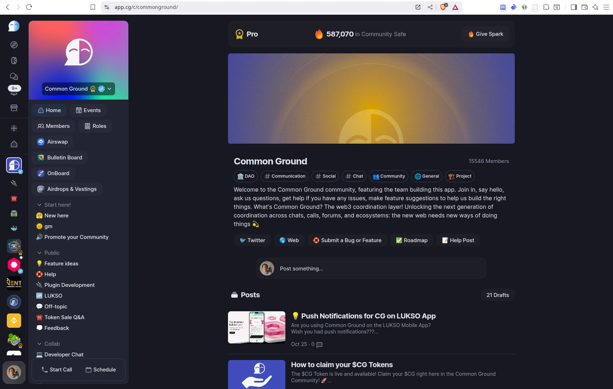 | 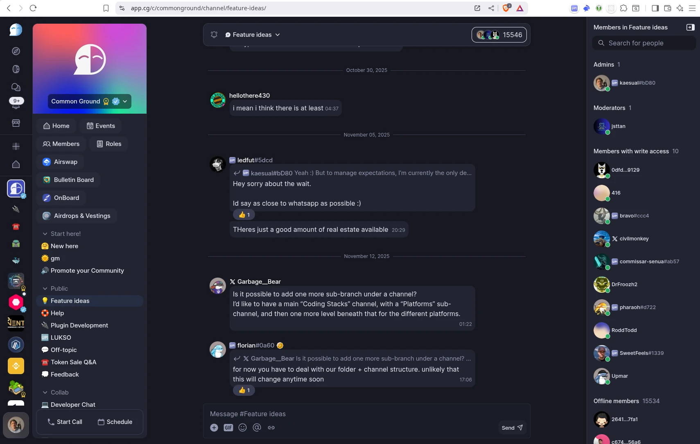 | 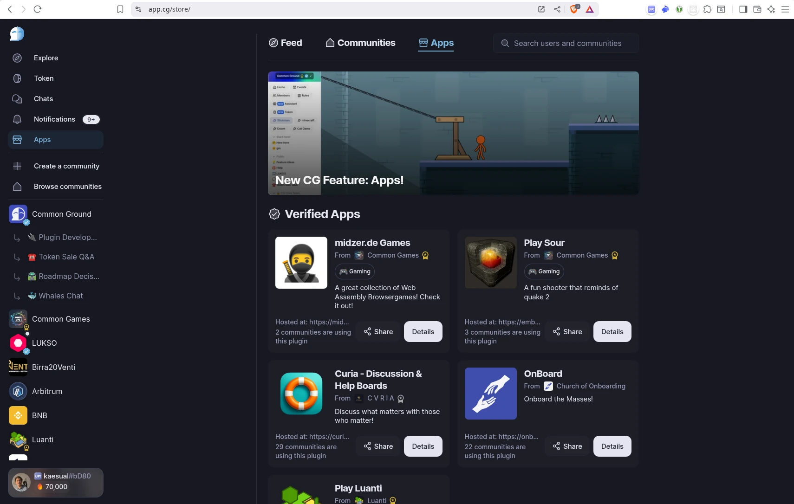 |
| 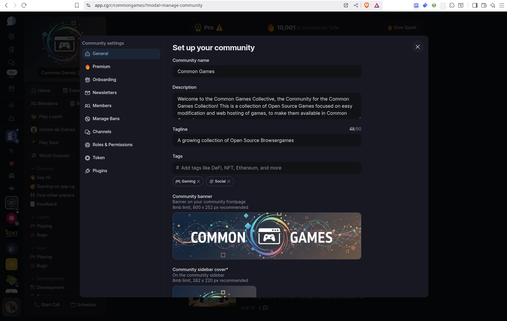 | 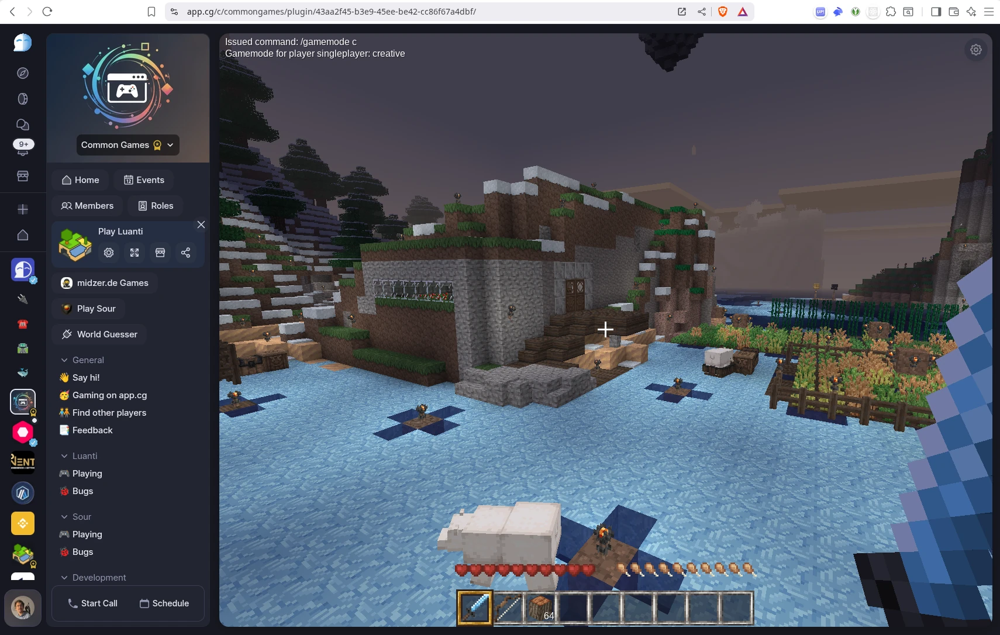 | 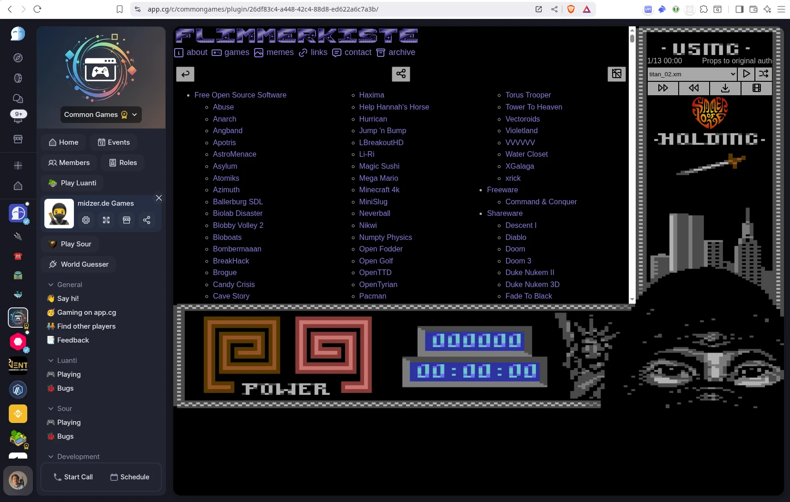 |
| 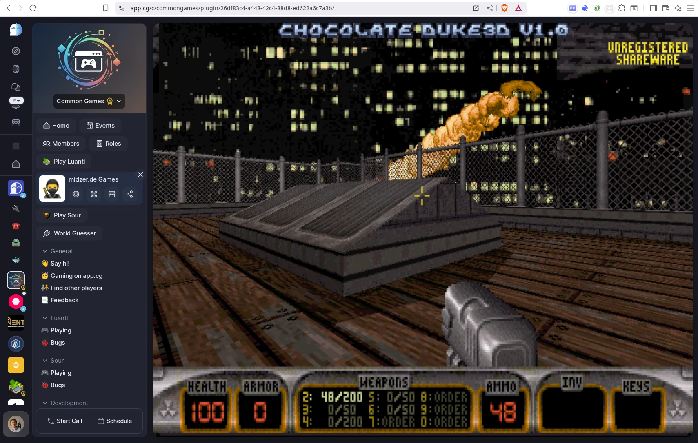 | 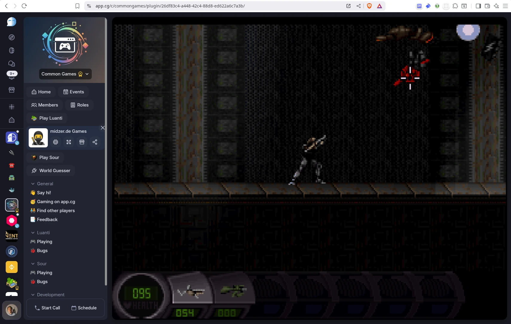 | 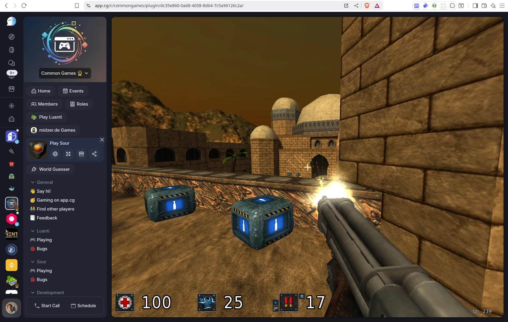 |

## Features

Common Ground offers a rich set of features designed for communities, DAOs, and creators:

*   **Community Management**: Create and manage communities with granular roles, permissions, and membership requirements (passwords, questionnaires, etc.).
*   **Communication**: Real-time chat channels, direct messages (DMs), and threaded conversations.
*   **HD Voice & Video**: Free 1080p voice and video calls, including group calls and Broadcasts with a video stage (similar to Twitter Spaces).
*   **Progressive Web App (PWA)**: Fully functional in the browser and installable on iOS, Android, and Desktop. Supports push notifications and offline capabilities.
*   **Plugin System**: A powerful ecosystem allowing deep integration of custom web apps, games, or tools directly into your community.
*   **Blockchain Integration**: Native support for all EVM chains. Use ERC20, ERC721, ERC1155, LSP7, and LSP8 tokens for gated roles and access.
*   **Content & Discovery**: Publish long-form community articles, appear in global content feeds, and manage community newsletters.
*   **Events**: Schedule events with built-in registration handling.

## The Plugin Ecosystem

Plugins are one of our most powerful features, allowing rich customization of the community experience. They enable bi-directional communication between the embedded application and the platform (e.g., assigning roles based on game activity).

We have released several open-source plugins to showcase these capabilities:
*   **Luanti (Minetest)**: A WebAssembly version of the open-source voxel game, featuring in-browser P2P hosting and save persistence.
*   **Sauerbraten**: A WebAssembly port of the Quake-like arcade shooter.
*   **Utilities**: Forums, Airdrop/Vesting tools, and a boilerplate `cg-base-plugin` for builders.

## Setup & Getting Started

If you just cloned the project:

1.  Run `./run.sh build_full` to build and run Common Ground. After the build is complete, the app will be available on `http://localhost:8000`. It will run in PWA mode, so when you rebuild, it will update.

2.  You can always update the running backend with `./run.sh update_backend`.

3.  If you want to run a local frontend that updates whenever you save changes, you can additionally run `./run.sh start`. This frontend will run on `http://localhost:3000`. Note: You also need to run the backend built with `build_full`, for the frontend to connect to.

4.  If you want to test voice calls locally, you need to run `./run.sh start_https` instead. The frontend will now run on `https://localhost:3000`, and you'll have to ignore the certificate warning.

## Our Mission

Currently, human connection is mediated by a small number of tech giants whose interests often diverge from those of an open society. 

Common Ground is our answer: a democratized, decentralized platform. While currently running on centralized infrastructure for ease of use, our roadmap moves towards a federated model where communities can host their own instances while remaining connected to the global Common Ground network.

## Join the Community

You are invited to join our own [Common Ground community on app.cg](https://app.cg/c/commonground/) to get in touch with the team, contributors, and supporters. Let's shape the future of the project together.

## Disclaimer

DISCLAIMER: THE SOFTWARE IS PROVIDED "AS IS", WITHOUT WARRANTY OF ANY KIND, EXPRESS OR IMPLIED, INCLUDING BUT NOT LIMITED TO THE WARRANTIES OF MERCHANTABILITY, FITNESS FOR A PARTICULAR PURPOSE AND NONINFRINGEMENT. IN NO EVENT SHALL THE AUTHORS OR COPYRIGHT HOLDERS BE LIABLE FOR ANY CLAIM, DAMAGES OR OTHER LIABILITY, WHETHER IN AN ACTION OF CONTRACT, TORT OR OTHERWISE, ARISING FROM, OUT OF OR IN CONNECTION WITH THE SOFTWARE OR THE USE OR OTHER DEALINGS IN THE SOFTWARE.